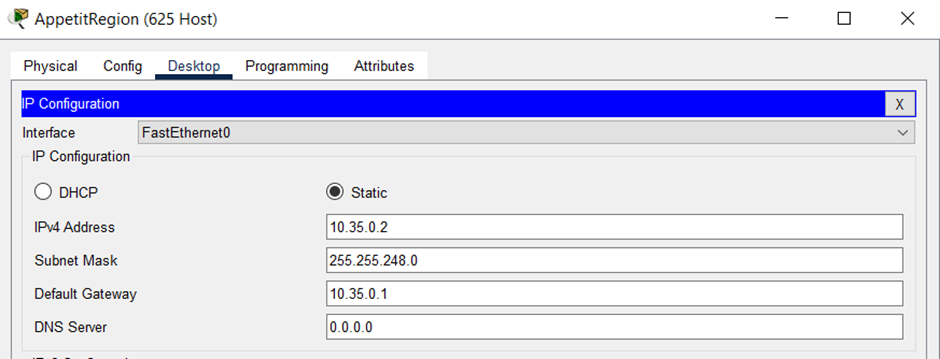
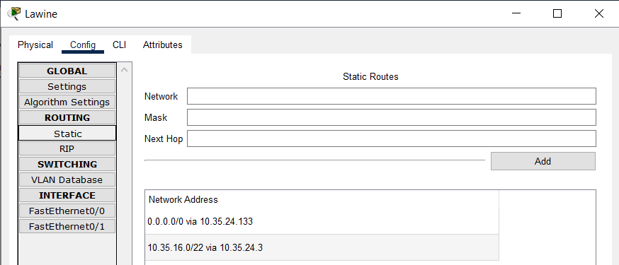
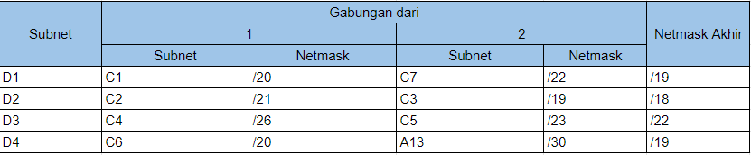

# Jarkom-Modul-4-D27-2023 (SUBNETTING AND ROUTING)

**SHEET PERHITUNGAN: [Cek disini selengkapnya](https://docs.google.com/spreadsheets/d/1AFVzDLOe8XgPUtKfZ6-JNdbXsctGGFvfrzY1KuioafU/edit?usp=sharing)**

**Anggota Kelompok Jarkom D27:**
* Duevano Fairuz Pandya (5025211052)
* 🤓

**PREFIX 10.35.x.x**

----------------------------------------------------------------------------------------------------------------------------------
## **SOAL**
 
1.	Soal shift dikerjakan pada Cisco Packet Tracer dan GNS3 menggunakan metode perhitungan CLASSLESS yang berbeda.
Keterangan: Bila di CPT menggunakan VLSM, maka di GNS3 menggunakan CIDR atau sebaliknya 
2.	Jika tidak ada pemberitahuan revisi soal dari asisten, berarti semua soal BERSIFAT BENAR dan DAPAT DIKERJAKAN. 
3.	Untuk di GNS3 CLOUD merupakan NAT1 jangan sampai salah agar bisa terkoneksi internet. 
4.	Pembagian IP menggunakan Prefix IP yang telah ditentukan pada modul pengenalan 
5.	Pembagian IP dan routing harus SE-EFISIEN MUNGKIN. 
Gambar topologi yang lebih jelas dapat diakses pada link berikut 

## **PENYELESAIAN**
Untuk menyelesaikan praktikum modul ini saya memilih mengerjakannya dengan membaginya menjadi:
* VLSM : Menggunakan Cisco Packet Tracer (CPT)
* CIDR : Menggunakan GNS3

Sebelumnya saya lakukan pembagian subnet (rute) sebagai berikut: 

* dari pembagian subnet ini nantinya akan saya temukan pembagian ip yang sesuai menggunakan metode classless VLSM dan CIDR Tree
* perhitungan ip sudah termasuk ip router
* pembagian ip digunakan untuk melakukan subnetting pada topologi
* setelah subnetting berhasil langkah terakhir adalah melakukan routing

### 1. VLSM (CPT)
   
**Berikut ini adalah VLSM tree yang telah saya buat:**

* karena pada pembagian subnet tercatat total ip adalah 4255 dan netmask cukup menampungnya adalah /19 yang mana mampu menampung ip sebanyak 8190
* root dari tree adalah netmask /19 dengan ip yang dimulai dari 10.35.0.0
* pada pembuatan tree ini saya menggunakan penambahan dari ip terkecil untuk mempermudah
* kaki kiri dari tree akan selalu menunjukkan awal mula dari ip yang tersedia, sedangkan kaki kanan adalah ip setelah ip kaki kiri
* pada kaki kiri juga saya berikan batas atas atau broadcast address dari ip dengan netmask tersebut untuk mempermudah penentuan ip di kaki kanan tree
* iterasi dilakukan terus menerus dari netmask /19 hingga /30
* sedikit catatan, tree yang saya buat tidak sepenuhnya mematuhi aturan binary tree sebagaimana mestinya, namun tetap mengikuti aturan pembagian ip yang sesuai

sehingga diperoleh pembagian ip VLSM:  

**Berikut ini adalah isi config pembagian IP VLSM (Subnetting) di CPT:** 
Untuk isi config pembagian ip saya set seperti ini:
* Router memliki `IP NID + 1`
* Host / Client memiliki `IP Rourter + 1` atau `IP Client sesubnet + 1`
* Host / Client memiliki gateway sesuai IP router dalam subnet mereka
* 1 router bisa memiliki beberapa IP karena dalam 1 router dapat menangani beberapa ethernet interface / subnet

Karena config semuanya kurang lebih mirip, jadi akan saya beri contoh assign IP Router dan Client dalam 1 Subnet saja: 
Fern: 
 
 

AppetitRegion: 

Laubhills: 
 

* Jika sudah maka dalam 1 Subnet ini semuanya pasti bisa saling melakukan ping
* Konfigurasi IP ini dilakukan ke SETIAP subnet nya sebagaimana pembagian IP di sheet perhitungan saya
* Untuk melihat CONFIG SELENGKAPNYA silahkan import file .pkt yang ada di repo ke CPT atau cek config berikut:

* Rohrroad: 
 
* Flamme:  
 
* SchwerMountains:  
 
* Himmel:  
 
* Frieren:  
 
* LakeKoridor:  
 
* Aura:  
 
* Denken:  
 
* RoyalCapital:  
 
* WilleRegion:  
 
* Eisen:  
 
* Richter:  
 
* Revolte:  
 
* Stark:  
 
* Lugner:  
 
* TurkRegion:  
 
* GrobeForest:  
 
* Linie:  
 
* GranzChannel:  
 
* Lawine:  
 
* BredtRegion:  
 
* Heiter:  
 
* Sein:  
 
* RiegelCanyon:  
 

**Routing** 
 
Untuk routing dilakukan dengan cara beberapa tahap:
* routing dilakukan dengan cara static dimana next hop dari routing adalah adjacent router terdekat dengan subnet yang ingin dituju, semisal aura ingin berkenalan dengan subnet a1 maka NID dan netmask diisi milik a1 dan next-hop nya adalah frieren
* binding everywhere (0.0.0.0) dilakukan seperti gambar di atas
* kemudian untuk setiap router yang terhubung dengan router lain (nexthop untuk berkenalan lebih dari 1hop) yang memiliki host/client perlu mengenali subnet mereka juga
* contoh:  - flamme harus berkenalan dengan subnet a1 dan a4  
          - frieren harus berkenalan dengan subnet a1, a2, a3, a4, a5 
          - aura harus berkenalan dengan semua subnet kecuali subnet a8, a10, a11 
          - lawine harus berkenalan dengan subnet a21 
          - linie harus berkenalan dengan subnet a20, a21 
          - eisen harus berkenalan dengan subnet a15, a16, a18, a19, a20, a21 
          - dst. 
* binding everywhere dari setiap router cukup 1 saja yang mengarah ke router aura / terdekat dengan aura, hal ini dilakukan untuk efisiensi routing (100% success)
* jika aura sudah disetup sebagaimana pengaturan routing di atas maka otomatis semua subnet bisa saling mengenal via aura 
* Untuk melihat CONFIG SELENGKAPNYA silahkan import file .pkt yang ada di repo ke CPT atau cek config berikut:

* Fern: 
 
* Flamme:  
 
* Himmel:  
 
* Frieren: 
 
* Aura:  
SEMUA SUBNET KECUALI SUBNET A8, A10, A11
* Denken:  
 
* Eisen:  
 
* Lugner:  
 
* Linie:  
 
* Lawine:  
 
* Heiter:  
 

**Berikut ini adalah beberapa contoh output ping** 

### 2. CIDR (GNS3)
  
**Berikut ini adalah proses pembuatan CIDR Tree** 

Proses penggabungan subnet dapat dilihat di Sheet perhitungan di atas atau cek disini:
I. 

II. 

III. 

IV. 

V. 

VI. 

* Penggabungan CIDR disini saya lakukan dengan cara iterasi pertama bertujuan untuk membuat subnet B agar semua jarak subnet adalah minimal 2 Hop ke Aura
* iterasi kedua membuat subnet C agar semua jarak subnet adalah minimal 0 atau 1 Hop
* iterasi ketiga dan seterusnya melakukan penggabungan semua 2 subnet yang bisa digabungkan
* hingga ditemui titik akhir yakni semua subnet tergabung menjadi 1 (G1 /16) 

CIDR IP tree:

* root dari tree adalah netmask /16 dengan ip yang dimulai dari 10.35.0.0 sebagai subnet G1
* pada pembuatan tree ini saya menggunakan penambahan dari ip terkecil untuk mempermudah
* kaki kiri dari tree akan selalu menunjukkan awal mula dari ip yang tersedia, sedangkan kaki kanan adalah ip setelah ip kaki kiri
* pada kaki kiri juga saya berikan batas atas atau broadcast address dari ip dengan netmask tersebut untuk mempermudah penentuan ip di kaki kanan tree
* kaki kiri tree akan selalu memiliki subnet dengan netmask yang lebih rendah dari kaki kanan untuk mempermudah penentuan ip
* struktur tree mengikuti aturan binary tree, dan setiap parent node merepresentasikan subnet gabungan dari sebelumnya
* jadi tree akan selalu mengikuti alur penggabungan dimana start dari subnet G dan end di subnet A

Sehingga diperoleh rekap pembagian ip tree sebagai berikut: 
 

**Berikut ini adalah isi config pembagian IP CIDR (Subnetting) di GNS3:** 
Untuk isi config pembagian ip saya set seperti ini:
* Router memliki `IP NID + 1`
* Host / Client memiliki `IP Broadcast - 1` atau `IP Client sesubnet - 1`
* Host / Client memiliki gateway sesuai IP router dalam subnet mereka
* 1 router bisa memiliki beberapa IP karena dalam 1 router dapat menangani beberapa ethernet interface / subnet
* Untuk lebih jelasnya:

 
* jika sudah maka dalam satu subnet pasti bisa saling ping

**Routing (SAMA SEPERTI SEBELUMNYA)** 
 
Untuk routing dilakukan dengan cara beberapa tahap:
* routing dilakukan dengan cara static dimana next hop dari routing adalah adjacent router terdekat dengan subnet yang ingin dituju, semisal aura ingin berkenalan dengan subnet a1 maka NID dan netmask diisi milik a1 dan next-hop nya adalah frieren
* binding everywhere (0.0.0.0) dilakukan seperti gambar di atas
* kemudian untuk setiap router yang terhubung dengan router lain (nexthop untuk berkenalan lebih dari 1hop) yang memiliki host/client perlu mengenali subnet mereka juga
* contoh:  - flamme harus berkenalan dengan subnet a1 dan a4  
          - frieren harus berkenalan dengan subnet a1, a2, a3, a4, a5 
          - aura harus berkenalan dengan semua subnet kecuali subnet a8, a10, a11 
          - lawine harus berkenalan dengan subnet a21 
          - linie harus berkenalan dengan subnet a20, a21 
          - eisen harus berkenalan dengan subnet a15, a16, a18, a19, a20, a21 
          - dst. 
* binding everywhere dari setiap router cukup 1 saja yang mengarah ke router aura / terdekat dengan aura, hal ini dilakukan untuk efisiensi routing (100% success)
* jika aura sudah disetup sebagaimana pengaturan routing di atas maka otomatis semua subnet bisa saling mengenal via aura 
* Untuk melihat CONFIG SELENGKAPNYA silahkan import file .pkt yang ada di repo ke CPT atau cek config berikut:

* Fern:  
 
* Flamme:  
 
* Himmel:  
 
* Frieren:  
 
* Aura:  
 
* Denken:  
 
* Eisen:  
 
* Lugner:  
 
* Linie:  
 
* Lawine:  
 
* Heiter:  
 

**Berikut ini adalah beberapa contoh output ping:** 
 
* ping aura ke subnet a1, a2, a6 
 
* ping aura ke subnet a3, a4, a5 
 
* ping aura ke subnet a7, a8, a9, a10 
 
* ping aura ke subnet a11, a12, a13, a14 
 
* ping aura ke subnet a15, a16, a17, a18 
 
* ping aura ke subnet a19, a20, a21  
